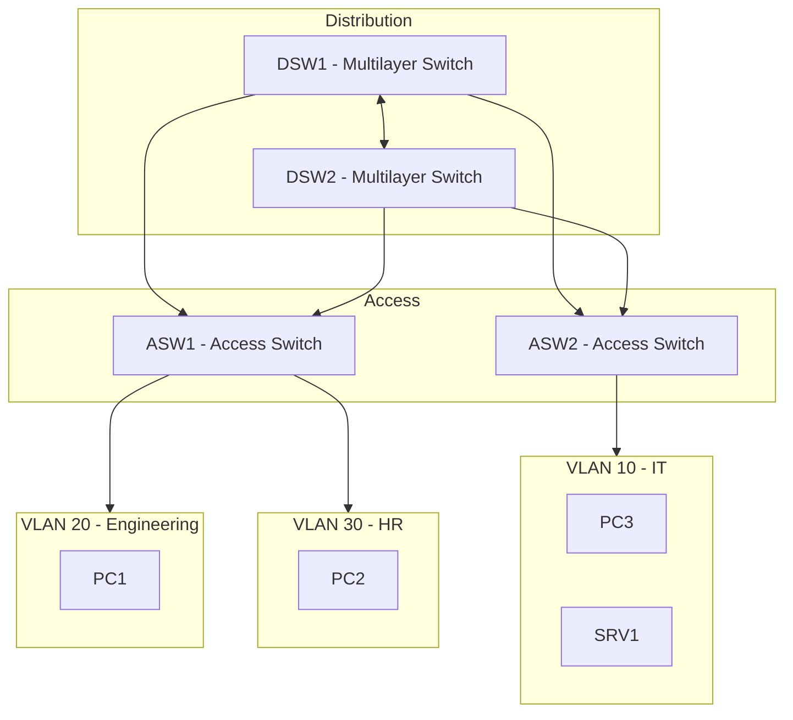

# CCNA Project 02 – Multilayer Campus Redundancy Design

## 1. Project Objective

Design and implement a resilient enterprise campus LAN using multilayer switching, redundant distribution switches, controlled Spanning Tree Protocol (STP), and gateway redundancy principles.

This project improves upon Project 01 by eliminating Router-on-a-Stick and introducing scalable, hardware-based inter-VLAN routing and Layer 2 redundancy mechanisms.

---

## 2. Architecture Overview

### Design Model

A simplified three-tier campus architecture was implemented:

- Distribution Layer:
  - DSW1 – Multilayer Switch (Primary STP Root for VLAN 10,20)
  - DSW2 – Multilayer Switch (Primary STP Root for VLAN 30)

- Access Layer:
  - ASW1 – Access Switch
  - ASW2 – Access Switch

- VLAN Segmentation:
  - VLAN 10 – IT
  - VLAN 20 – Engineering
  - VLAN 30 – HR
  - VLAN 99 – Management
  - VLAN 999 – Native Blackhole

---

## 3. Design Improvements from Project 01

| Project 01 | Project 02 |
|------------|------------|
| Router-on-a-Stick | Multilayer Switching (SVI) |
| Single uplink | Redundant distribution layer |
| No root control | Explicit STP root placement |
| Single point of failure | Gateway redundancy awareness |
| CPU-based routing | ASIC hardware routing |

---

## 4. Network and Logical Topology

 

---

## 5. VLAN & IP Addressing Plan
| VLAN | Name        | Subnet          | Virtual Gateway |
| ---- | ----------- | --------------- | --------------- |
| 10   | IT          | 192.168.10.0/24 | 192.168.10.254  |
| 20   | Engineering | 192.168.20.0/24 | 192.168.20.254  |
| 30   | HR          | 192.168.30.0/24 | 192.168.30.254  |
| 99   | Management  | 192.168.99.0/24 | 192.168.99.254  |
| 999  | Native      | No Hosts        | N/A             |

Inter-VLAN routing is performed using Switch Virtual Interfaces (SVIs).

---

## 6. Key Technical Components
### 6.1 Multilayer Inter-VLAN Routing
  - ip routing enabled                
  - SVI interfaces configured for each VLAN
  - Hardware-based routing (ASIC forwarding)

### 6.2 STP Root Bridge Control
  - DSW1 configured as root primary for VLAN 10 & 20
  - DSW2 configured as root primary for VLAN 30
Purpose:
  - Ensures predictable Layer 2 traffic flow
  - Prevents suboptimal forwarding paths

### 6.3 Redundant Trunk Links
  - Distribution switches interconnected via trunk
  - Access switches dual-homed to both distribution switches
  - Explicit VLAN allow-list
  - Native VLAN set to 999
  - DTP disabled

### 6.4 Gateway Redundancy Awareness
Where supported:        
  - HSRP configured to provide first-hop redundancy
                                                                                                   
If HSRP unavailable:                                                                                           
  - Design documented with redundancy intent

---

## 7. Validation & Verification
### Layer 2 Validation
  - `show spanning-tree`
  - `show spanning-tree vlan X`
  - `show interfaces trunk`
  - `show vlan brief`

### Layer 3 Validation
  - `show ip route`
  - `show ip interface brief`

### Failover Testing
  - Shutdown active trunk and observe STP reconvergence
  - Shutdown active gateway SVI and validate failover
  - Verify continuous host connectivity during link failure

Validation results are documented in the `/validation` directory.

---

## 8. Failure Scenarios Simulated
  - STP root misplacement
  - Trunk failure
  - Gateway SVI shutdown
  - VLAN allowed list mismatch
  - Native VLAN mismatch

Structured troubleshooting approach applied at each layer.

---

## 9. Design Rationale
### Why Multilayer Switching?
  - Hardware-based routing improves performance
  - Eliminates router bottleneck
  - Scales better in enterprise environments

### Why Control STP Root?
  - Ensures traffic flows toward intended distribution switch
  - Prevents unpredictable spanning-tree elections

### Why Dual Distribution Switches?
  - Removes single point of failure
  - Increases availability

Simulates enterprise campus redundancy

---

## 10. Lessons Learned
  - Redundancy without STP control can cause suboptimal paths
  - Hardware-based routing significantly improves scalability
  - Gateway redundancy is critical for high availability
  - Proper validation commands prevent guess-based troubleshooting
  - Enterprise design requires deterministic behavior, not defaults

---

## 11. Skills Demonstrated
  - Multilayer switching configuration
  - Inter-VLAN routing via SVI
  - STP root bridge manipulation
  - Redundant trunk design
  - Gateway redundancy concepts (HSRP)
  - Structured failover validation
  - Enterprise-focused troubleshooting

---

## 12. Tools Used
  - Cisco Packet Tracer
  - CLI-based configuration
  - Structured validation methodology
