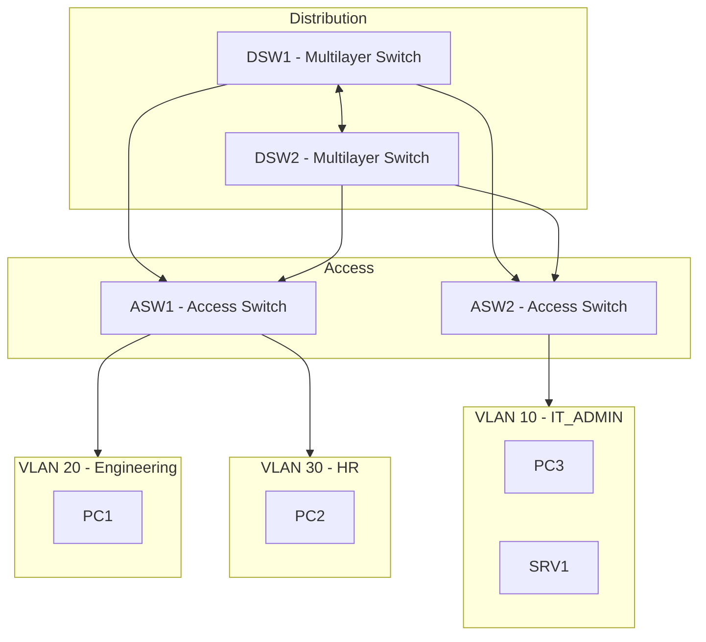

# CCNA Project 02 – Multilayer Campus Redundancy Design

## 1. Project Objective

Design and validate a resilient enterprise-style campus LAN using multilayer switching, inter-VLAN routing with Switch Virtual Interfaces (SVIs), controlled Spanning Tree Protocol (STP), redundant trunk links, and HSRP-based first-hop redundancy.

This project builds on Project 01 by replacing Router-on-a-Stick with multilayer switching and introducing structured Layer 2 and Layer 3 redundancy concepts commonly used in campus networks.

---

## 2. Architecture Overview

### Design Model

A simplified campus design was implemented using a distribution and access layer model.

#### Distribution Layer
- **DSW1** – Multilayer Switch  
  - Primary STP root for VLAN 10 and VLAN 20
  - HSRP active gateway for VLAN 10 and VLAN 20

- **DSW2** – Multilayer Switch  
  - Primary STP root for VLAN 30
  - HSRP active gateway for VLAN 30

#### Access Layer
- **ASW1** – Access Switch
- **ASW2** – Access Switch

#### VLAN Segmentation
- **VLAN 10** – IT_ADMIN
- **VLAN 20** – ENGINEERING
- **VLAN 30** – HR
- **VLAN 99** – MANAGEMENT
- **VLAN 999** – NATIVE_BLACKHOLE

---

## 3. Design Improvements from Project 01

| Project 01 | Project 02 |
|------------|------------|
| Router-on-a-Stick | Multilayer switching with SVIs |
| Single uplink path | Redundant distribution-layer uplinks |
| Limited redundancy | First-hop and Layer 2 redundancy |
| Default STP behavior | Explicit STP root placement |
| External router for inter-VLAN routing | On-switch hardware-based routing |

---

## 4. Network and Logical Topology

---

## 5. VLAN and IP Addressing Plan
| VLAN | Name                  | Subnet          | Virtual Gateway |
| ---- | --------------------- | --------------- | --------------- |
| 10   | IT_ADMIN              | 192.168.10.0/24 | 192.168.10.254  |
| 20   | ENGINEERING           | 192.168.20.0/24 | 192.168.20.254  |
| 30   | HR                    | 192.168.30.0/24 | 192.168.30.254  |
| 99   | MANAGEMENT            | 192.168.99.0/24 | 192.168.99.254  |
| 999  | NATIVE_BLACKHOLE      | No Hosts        | N/A             |

Inter-VLAN routing is performed using Switch Virtual Interfaces (SVIs).

---

## 6. Key Technical Components
### 6.1 Multilayer Inter-VLAN Routing
- `ip routing` enabled on both distribution switches
- SVIs configured for user and management VLANs
- Inter-VLAN routing handled on the multilayer switches

### 6.2 STP Root Bridge Control
- DSW1 configured as primary STP root for VLAN 10 and VLAN 20
- DSW2 configured as primary STP root for VLAN 30
This was done to:
- create predictable Layer 2 forwarding behavior
- prevent uncontrolled root bridge elections
- align Layer 2 forwarding with gateway design intent

### 6.3 Redundant Trunk Design
- Distribution switches interconnected with trunk links
- Access switches dual-homed to both distribution switches
- Explicit VLAN allow-list configured on trunks
- Native VLAN set to VLAN 999
- DTP disabled using `switchport nonegotiate`

### 6.4 HSRP First-Hop Redundancy
HSRP was configured on the distribution-layer SVIs to provide default-gateway redundancy.

#### HSRP Active Gateway Ownership
- **DSW1 active**
  - VLAN 10
  - VLAN 20

- **DSW2 active**
  - VLAN 30

This design provides split default-gateway ownership while preserving first-hop redundancy.

---

## 7. Validation & Verification
Validation results are documented in the [`validation/`](validation/) directory.

### Baseline Validation
The following were verified before failover testing:
- VLAN presence across all switches
- trunk operational state
- STP forwarding/blocking behavior
- HSRP active/standby ownership
- successful host-to-gateway and inter-VLAN connectivity

### HSRP Failover Validation
HSRP failover was validated by simulating loss of the active distribution switch path and confirming that the standby switch maintained:
- gateway reachability through the HSRP virtual IP
- inter-VLAN connectivity
- continued forwarding after failover

### STP Failover Validation
STP failover was validated by shutting down one redundant access uplink and confirming:
- STP reconvergence to the alternate path
- continued connectivity after reconvergence
- expected Layer 2 redundancy behavior

### Recovery Validation
After failure testing, interfaces were restored and the topology was checked to confirm:
- HSRP roles returned to the intended design
- trunk links returned to normal operation
- STP returned to the expected forwarding/blocking state
- end-to-end connectivity was fully restored

---

## 8. Commands Used for Verification
### Layer 2 Verification
- `show vlan brief`
- `show interfaces trunk`
- `show spanning-tree`
- `show spanning-tree vlan <id>`

### Layer 3 / Gateway Verification
- `show ip interface brief`
- `show standby brief`
- `ping <destination>`

---

## 9. Design Rationale
### Why Multilayer Switching?
- removes dependence on external router-on-a-stick design
- improves scalability for inter-VLAN routing
- better reflects enterprise campus switching design

### Why Control STP Root?
- ensures predictable traffic flow
- reduces the chance of suboptimal Layer 2 paths
- aligns forwarding behavior with distribution-layer design

### Why Dual Distribution Switches?
- reduces single points of failure
- provides better availability for gateway and path redundancy
- introduces a more realistic campus redundancy model

### Why Use HSRP?
- provides first-hop gateway redundancy for end devices
- allows virtual gateway continuity during switch/path failure
- reflects common enterprise gateway design practice

---

## 10. Lessons Learned
- redundant Layer 2 paths require STP control to avoid loops and unstable forwarding
- first-hop redundancy and Layer 2 path redundancy must be validated separately
- multilayer switching provides a cleaner enterprise design than router-on-a-stick
- Packet Tracer can simplify or limit some control-plane visibility, so operational validation is important
- successful validation depends on both correct configuration and structured testing

---

## 11. Skills Demonstrated
- multilayer switching configuration
- inter-VLAN routing using SVIs
- STP root bridge placement
- redundant trunk configuration
- HSRP configuration and validation
- failover testing and recovery validation
- structured troubleshooting in a campus LAN topology

---

## 12. Tools Used
- Cisco Packet Tracer
- Cisco IOS CLI
- Markdown documentation
- Structured validation workflow
