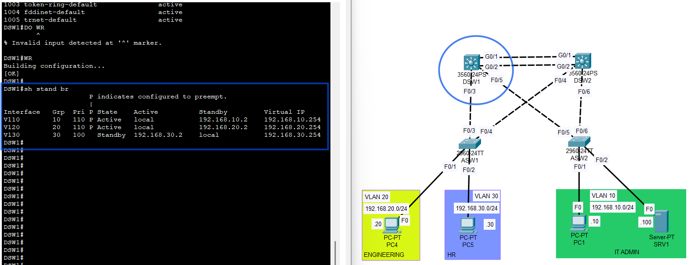
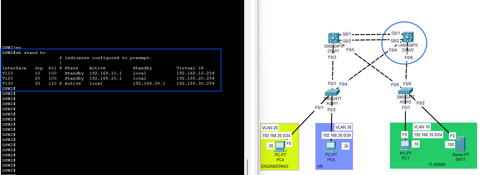
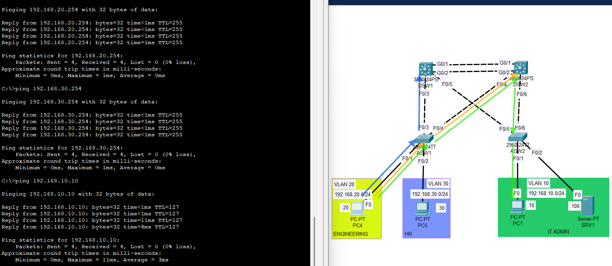

# Baseline Validation

## Objective
Confirm that the multilayer campus topology is operating normally before any failure is introduced.

## Scope
Baseline validation was performed to verify:

- VLAN presence across all switches
- trunk operation between access and distribution switches
- HSRP gateway ownership
- inter-VLAN connectivity
- host reachability to default gateways

## VLAN Verification
The following VLANs were confirmed to exist on all switches:

- VLAN 10 - IT_ADMIN
- VLAN 20 - ENGINEERING
- VLAN 30 - HR
- VLAN 99 - MGMT / MANAGEMENT
- VLAN 999 - NATIVE_BLACKHOLE

## Trunk Verification
Operational trunk checks confirmed that:

- trunk links were up between the access and distribution layers
- 802.1Q encapsulation was in use
- native VLAN was set to 999
- allowed VLANs on trunks were:
  - 10
  - 20
  - 30
  - 99
  - 999

## STP Baseline Observation
Spanning Tree Protocol was operating normally in the redundant Layer 2 topology.

Some redundant trunk links appeared with no forwarding VLANs in the `show interfaces trunk` output under:

- `Vlans in spanning tree forwarding state and not pruned`

This was expected because STP blocks redundant paths to prevent switching loops.

## HSRP Baseline State
The intended HSRP active/standby roles were confirmed.

### DSW1
- VLAN 10 - Active
- VLAN 20 - Active
- VLAN 30 - Standby

### DSW2
- VLAN 10 - Standby
- VLAN 20 - Standby
- VLAN 30 - Active

This provided split first-hop gateway ownership across the two distribution switches.

## Connectivity Verification
Baseline ping tests were successful.

### Verified Results
- Hosts in VLAN 10 successfully reached:
  - the HSRP virtual default gateway
  - hosts in VLAN 20
  - hosts in VLAN 30

- Hosts in VLAN 20 successfully reached:
  - the HSRP virtual default gateway
  - hosts in VLAN 10
  - hosts in VLAN 30

- Hosts in VLAN 30 successfully reached:
  - the HSRP virtual default gateway
  - hosts in VLAN 10
  - hosts in VLAN 20

## Commands Used
The following commands were used during baseline validation:

```plaintext
show vlan brief
show interfaces trunk
show standby brief
ping <default-gateway>
ping <remote-host>
```

## Evidence

### HSRP Baseline
DSW1 baseline HSRP state:



DSW2 baseline HSRP state:



### Baseline Connectivity
Example successful baseline ping tests:



## Result
Baseline validation passed.

The topology was confirmed to be stable and ready for failover testing.
