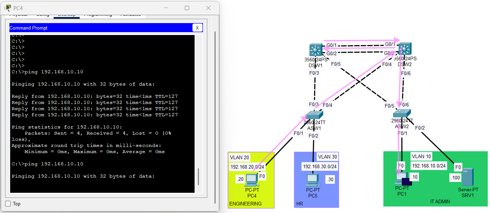
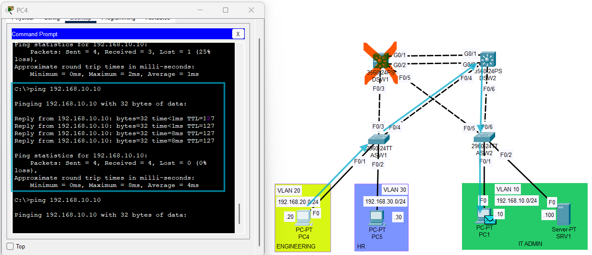
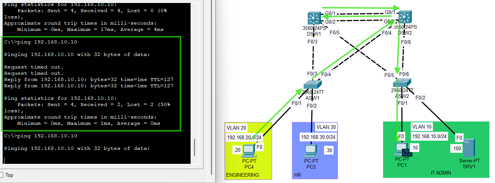

# Failover Test 1 - HSRP Active Distribution Switch Failure

## Objective
Validate first-hop gateway redundancy by simulating the loss of the active distribution switch path and confirming that the standby HSRP peer maintains gateway availability and inter-VLAN connectivity.

## Failure Scenario
At baseline, HSRP ownership was:

- **DSW1 active**
  - VLAN 10
  - VLAN 20

- **DSW2 active**
  - VLAN 30

To simulate failure of the active distribution path, forwarding and trunk ports on DSW1 were administratively shut down.

## Why This Test Was Used
Cisco Packet Tracer did not always provide consistent control-plane visibility for every HSRP state change during earlier testing.

Because of that, this validation focused on operational failover behavior:

- loss of the active distribution switch path
- standby switch takeover
- continued host connectivity through the HSRP virtual gateway

## Expected Result
During the failure:

- DSW2 should take over gateway responsibility for VLAN 10 and VLAN 20
- hosts should continue to reach their default gateway through the HSRP virtual IP
- inter-VLAN communication should continue after failover
- a brief interruption may occur during convergence

## Failure Injection
The following interfaces on DSW1 were shut down to simulate loss of the active distribution switch path:

```plaintext
interface FastEthernet0/3
 shutdown
interface FastEthernet0/5
 shutdown
interface GigabitEthernet0/1
 shutdown
interface GigabitEthernet0/2
 shutdown
```
## Observed Result
  - After shutting down the forwarding and trunk interfaces on DSW1:
  - hosts in affected VLANs were still able to reach the HSRP virtual gateway
  - inter-VLAN communication remained available through DSW2
  - failover behavior was successfully demonstrated in Packet Tracer
This confirmed that first-hop redundancy was functioning as intended.

## Validation Method
Failover was validated using:
  - host ping tests
  - HSRP role observation where available
  - end-to-end connectivity checks before and after the simulated failure

## Commands Used
The following commands were used during this test:
```plaintext
show standby brief
show interfaces trunk
ping <default-gateway>
ping <remote-host>
```

## Evidence

### Before Failure


### During Failover


### Connectivity After Failover


## Notes
This test used operational path failure rather than shutting down individual SVIs because Packet Tracer handled switch-path loss more predictably than interface-level HSRP state testing.

## Result
HSRP failover validation passed.
The standby distribution switch successfully maintained gateway availability and end-to-end connectivity after loss of the active distribution switch path.
