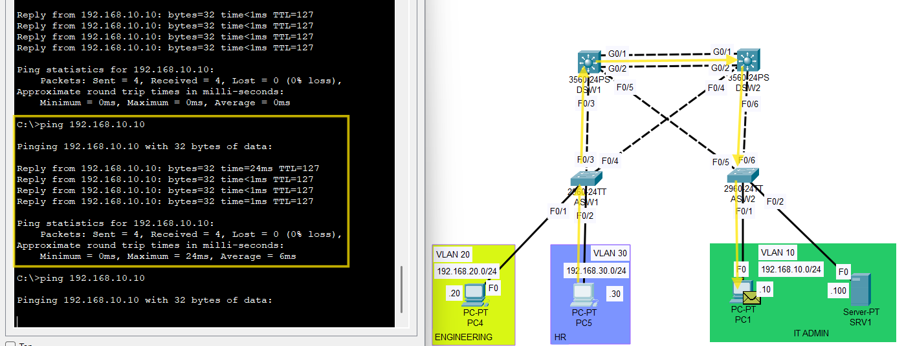

# Failover Test 2 - STP Access Uplink Failure

## Objective
Validate Layer 2 path redundancy by shutting down a redundant access-switch uplink and confirming that traffic continues through the alternate spanning-tree path.

## Failure Scenario
The topology used redundant trunk uplinks between the access and distribution layers.

At baseline, STP placed one redundant uplink path into a blocking or non-forwarding state to prevent a Layer 2 loop. To test Layer 2 failover, one access-switch uplink was administratively shut down so that traffic would use the alternate path.

## Why This Test Was Used
This test was designed to validate switched path redundancy rather than first-hop gateway ownership.

Unlike HSRP failover testing, the purpose of this test was not to change the active gateway, but to confirm that STP reconverged correctly after loss of a redundant Layer 2 link.

## Expected Result
During the failure:

- hosts should continue to reach their default gateway
- inter-VLAN communication should remain available
- traffic should shift to the alternate trunk path
- STP should maintain a loop-free topology after reconvergence
- a brief interruption may occur during convergence

## Failure Injection
One redundant access-switch uplink was administratively shut down to simulate loss of a Layer 2 path.

Example: ASW1

```plaintext
interface FastEthernet0/4 
 shutdown
```

## Observed Result
After shutting down the selected access-switch uplink:

- traffic continued through the alternate path
- hosts were still able to reach the HSRP virtual gateway
- inter-VLAN communication remained available
- STP reconvergence behavior was successfully demonstrated in Packet Tracer

This confirmed that Layer 2 path redundancy was functioning as intended.

## Validation Method
Failover was validated using:
  - host ping tests
  - trunk state checks
  - STP operational observations before and after the simulated failure

## Commands Used
The following commands were used during this test:
```plaintext
show interfaces trunk
show spanning-tree
ping <default-gateway>
ping <remote-host>
```

## Evidence
### Before Failure


### During Failover


### Connectivity After Reconvergence

    
## Notes
This test focused on Layer 2 path failover only. HSRP remained in place to provide first-hop gateway redundancy, but the purpose of this validation was to confirm that redundant switched paths remained usable after uplink loss.

## Result
STP failover validation passed.

The topology maintained loop-free Layer 2 redundancy and preserved end-to-end connectivity after loss of a redundant access uplink.
