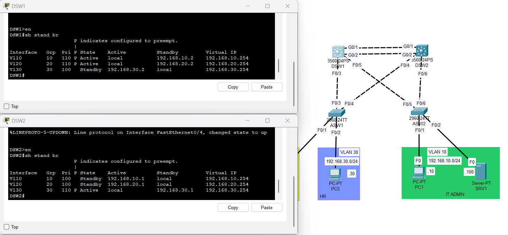
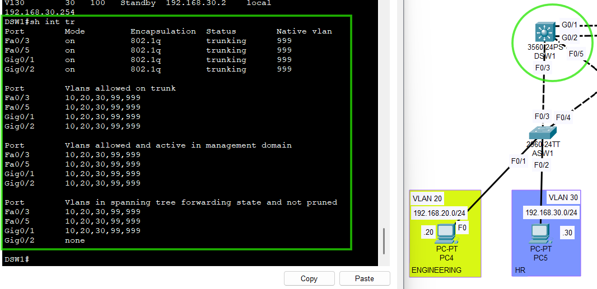
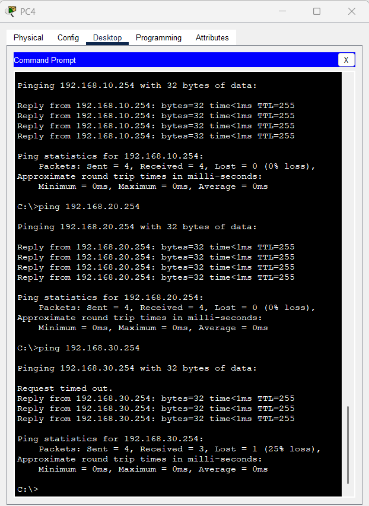

# Recovery Validation

## Objective
Confirm that the topology returns to its intended steady state after failover testing is completed and all previously disabled interfaces are restored.

## Recovery Scope
Recovery validation was performed after the HSRP and STP failover tests to verify that:

- administratively shut interfaces were brought back up
- trunk links returned to normal operational status
- HSRP active/standby roles returned to the intended design
- STP returned to the expected forwarding/blocking state
- end-to-end connectivity was fully restored

## Recovery Actions
After completing failure testing, all interfaces that were shut down during validation were re-enabled using `no shutdown`.

This included:

- distribution switch trunk/forwarding interfaces used during HSRP failover testing
- access switch trunk uplinks used during STP failover testing

## Expected Recovery State
After recovery:

- DSW1 should resume HSRP active role for:
  - VLAN 10
  - VLAN 20

- DSW2 should resume HSRP active role for:
  - VLAN 30

- trunk links should return to their normal operational state
- STP should again block redundant paths as needed to prevent loops
- hosts in all VLANs should successfully reach:
  - the HSRP virtual default gateway
  - hosts in other VLANs

## Validation Method
Recovery was verified using:

- `show standby brief`
- `show interfaces trunk`
- `show spanning-tree vlan <id>`
- host ping tests

## Commands Used
```plaintext
show standby brief
show interfaces trunk
show spanning-tree vlan 10
show spanning-tree vlan 20
show spanning-tree vlan 30
ping <default-gateway>
ping <remote-host>
```

## Observed Result
After restoring the previously disabled interfaces:

- HSRP roles returned to the intended design
- trunk links returned to normal operation
- STP re-established the expected forwarding and blocking behavior
- hosts in all VLANs regained or maintained full connectivity

This confirmed that the topology recovered cleanly after failover testing.

## Evidence

### HSRP Recovery State
DSW1 and DSW2 HSRP state after recovery:



### Trunk Recovery State
DSW1 trunk operational state after recovery:



### Connectivity After Recovery
Successful host connectivity after restoring the topology:



## Notes
Recovery validation is important because redundancy testing is incomplete unless the network can also return to its original steady-state design after the fault is removed.

## Result
Recovery validation passed.

The multilayer campus topology successfully returned to the intended baseline state after failover testing.
